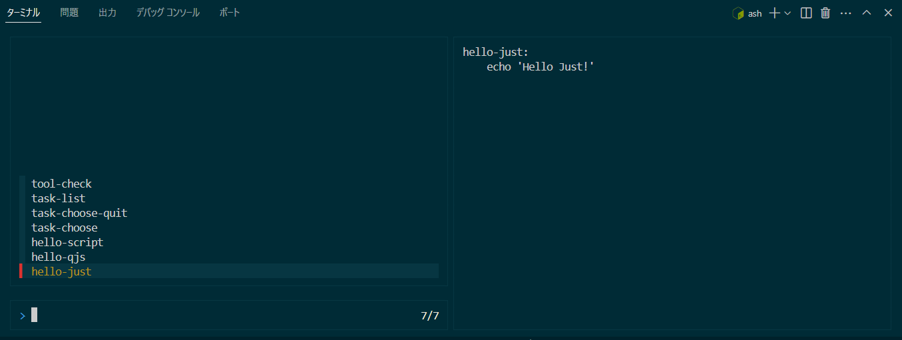

# my-task-runner-toolset

## TODO

- busybox ash aaa.sh →　マルチバイト文字が文字化け
- BusyBox の使用はやめて、Git-Bash に変更する　※こっちは文字化けしないので

## 概要

- タスクランナーに Just を用いる
- Windows でも ~~Linux でも~~ ash を使えるようにする\
  ※Linux 版の BusyBox ash
  は入力時にマルチバイト文字が?に文字化けするにであきらめ
- Shell スクリプトを使えるようにする
- JavaScript を使えるようにする
- エラーが起きたら止まるようにする（後続処理を実行しない）
- 容量を少なくし、再配布に支障が無いようにする

## 詳細

### タスクを選択して実行

`just` または `just task-choose` でタスク一覧から選択して実行\


### タスクを指定して実行

`just <タスク名>`

```
$ just hello-just
Hello Just!
```

### タスク一覧を表示

`just task-list`

```
$ just task-list
タスク一覧:
    hello-qjs
    hello-just
    hello-script

    [task]
    task-choose      # タスク一覧から選択して実行（デフォルト）
    task-choose-quit # タスク選択を終了
    task-list        # タスク一覧を表示

    [tool]
    tool-check       # 必要なツールが揃っているかと、そのバージョンの確認
```

## qjs-shell（実験的）

qjs で google の zx っぽいことする試み。\
※業務で使えるレベルでは全くありません！

./scripts/qjs-shell-example.js

```js
import { $ } from "../lib/js/qjs-shell.js";

const result = $`echo あいうえお`;
console.log(result);
```

```sh
$ qjs ./scripts/qjs-shell-example.js
あいうえお
```
